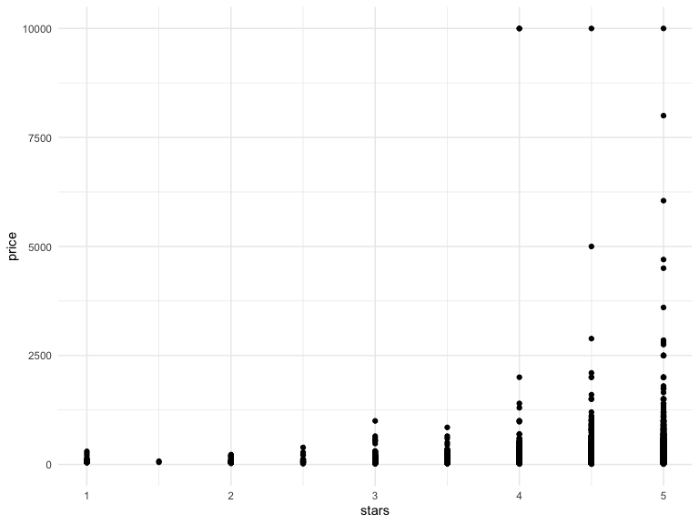

Bootstrapping
================

``` r
library(tidyverse)
library(modelr)
library(mgcv)
library(viridis)
library(p8105.datasets)
library(patchwork)


knitr::opts_chunk$set(
  echo = TRUE,
  warning = FALSE,
  fig.width = 8,
  fig.height = 6,
  out.width = "90%"
)

options(
  ggplot2.continuous.colour = "viridis",
  ggplot2.continuous.fill = "viridis"
)

scale_color_discrete = scale_colour_viridis_d
scale_fill_discrete = scale_fill_viridis_d

theme_set(theme_minimal() + theme(legend.position = "bottom"))
```

## Simulate dataset

``` r
set.seed(1)

n_samp = 250

sim_df_const = 
  tibble(
    x = rnorm(n_samp, 1, 1),
    error = rnorm(n_samp, 0, 1),
    y = 2 + 3 * x + error
  )

sim_df_nonconst = sim_df_const %>% 
  mutate(
  error = error * .75 * x,
  y = 2 + 3 * x + error
)
```

Make a plot

``` r
sim_df_const %>% 
  ggplot(aes(x = x, y = y)) + 
  geom_point()
```


``` r
sim_df_const %>% 
  lm(y ~ x, data = .) %>% 
  broom::tidy()
```

    ## # A tibble: 2 × 5
    ##   term        estimate std.error statistic   p.value
    ##   <chr>          <dbl>     <dbl>     <dbl>     <dbl>
    ## 1 (Intercept)     1.98    0.0981      20.2 3.65e- 54
    ## 2 x               3.04    0.0699      43.5 3.84e-118

## Try using boostrap for inference

``` r
boostrap_sample = 
  sim_df_nonconst %>% 
  sample_frac(size = 1, replace = TRUE) %>% 
  arrange(x)

lm(y~x, data = boostrap_sample)
```

    ## 
    ## Call:
    ## lm(formula = y ~ x, data = boostrap_sample)
    ## 
    ## Coefficients:
    ## (Intercept)            x  
    ##       1.897        3.196

Write a function…

``` r
boot_sample = function(df) {
  sample_frac(df, replace = TRUE)
}
```

Make a tibble to keep track of everything

``` r
boot_strap_df = 
  tibble(
    strap_number = 1:1000,
    #rerun the sample function for 1000 times
    strap_sample = rerun(1000, boot_sample(sim_df_nonconst))
  )
```

From here, things are kinda the same as always

``` r
bootstrap_results = 
  boot_strap_df %>% 
  mutate(
    models = map(strap_sample, ~lm(y ~ x, data = .x) ),
    results = map(models, broom::tidy)) %>% 
  select(-strap_sample, -models) %>% 
  unnest(results) 


bootstrap_results %>% 
  ggplot(aes(x = estimate)) +
  geom_histogram() +
  facet_grid(~term, scales = "free")
```

    ## `stat_bin()` using `bins = 30`. Pick better value with `binwidth`.


``` r
bootstrap_results %>% 
  group_by(term) %>% 
  summarize(boot_se = sd(estimate)) %>% 
  knitr::kable(digits = 3)
```

| term        | boot_se |
|:------------|--------:|
| (Intercept) |   0.075 |
| x           |   0.101 |

## Use ‘modelr’

``` r
sim_df_nonconst %>% 
  bootstrap(n = 1000, id = "strap_number") %>% 
  mutate(
    models = map(.x = strap, ~lm(y~x, data = .x)),
    results = map(models, broom::tidy)
  )
```

    ## # A tibble: 1,000 × 4
    ##    strap                strap_number models results         
    ##    <list>               <chr>        <list> <list>          
    ##  1 <resample [250 x 3]> 0001         <lm>   <tibble [2 × 5]>
    ##  2 <resample [250 x 3]> 0002         <lm>   <tibble [2 × 5]>
    ##  3 <resample [250 x 3]> 0003         <lm>   <tibble [2 × 5]>
    ##  4 <resample [250 x 3]> 0004         <lm>   <tibble [2 × 5]>
    ##  5 <resample [250 x 3]> 0005         <lm>   <tibble [2 × 5]>
    ##  6 <resample [250 x 3]> 0006         <lm>   <tibble [2 × 5]>
    ##  7 <resample [250 x 3]> 0007         <lm>   <tibble [2 × 5]>
    ##  8 <resample [250 x 3]> 0008         <lm>   <tibble [2 × 5]>
    ##  9 <resample [250 x 3]> 0009         <lm>   <tibble [2 × 5]>
    ## 10 <resample [250 x 3]> 0010         <lm>   <tibble [2 × 5]>
    ## # … with 990 more rows

## Airbnb data

``` r
data("nyc_airbnb") 

nyc_airbnb = 
  nyc_airbnb %>% 
  mutate(stars = review_scores_location / 2 ) %>% 
  rename(borough = neighbourhood_group) %>% 
  filter(borough != "Staten Island") %>% 
  select(price, stars, borough, room_type)
```

``` r
nyc_airbnb %>% 
  ggplot(aes(x = stars, y = price)) +
  geom_point()
```



``` r
airbnb_boostrap_results = 
  nyc_airbnb %>% 
  filter(borough == "Manhattan") %>% 
  bootstrap(n = 1000, id = "strap_number") %>% 
  mutate(
    models = map(.x = strap, ~lm(price ~ stars, data = .x)),
    results = map(models, broom::tidy)
  ) %>% 
  select(strap_number, results) %>% 
  unnest(results)

gg_star_est = 
  airbnb_boostrap_results %>% 
  filter(term == "stars") %>% 
  ggplot(aes(estimate)) +
  geom_density()

gg_scatter = 
  nyc_airbnb %>% 
  filter(borough == "Manhattan") %>% 
  ggplot((aes(x = stars, y = price))) +
  geom_point()

gg_star_est + gg_scatter
```


